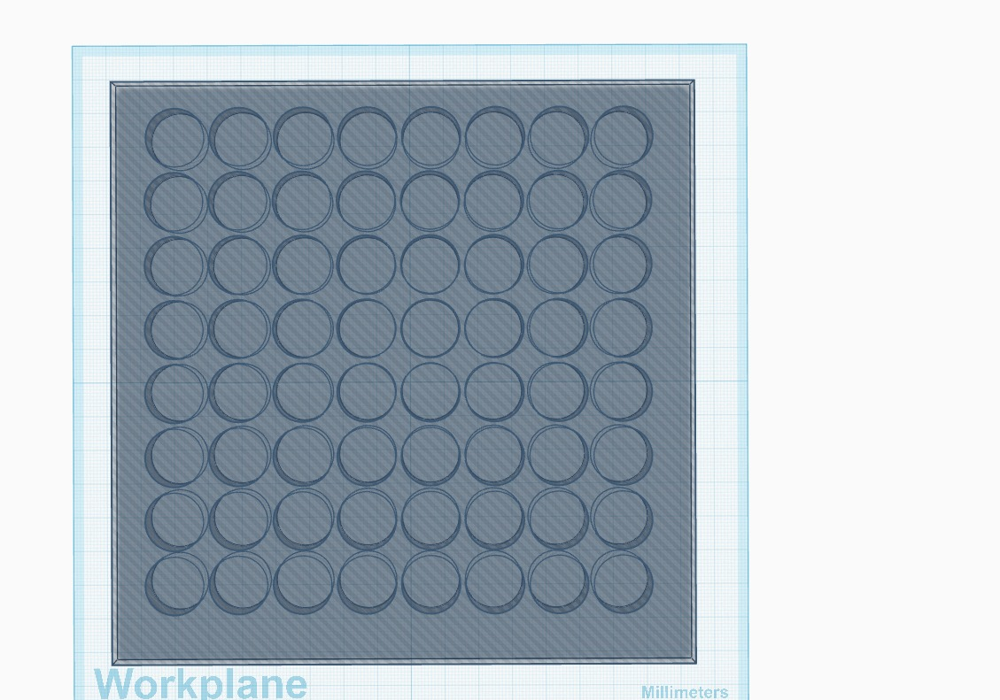
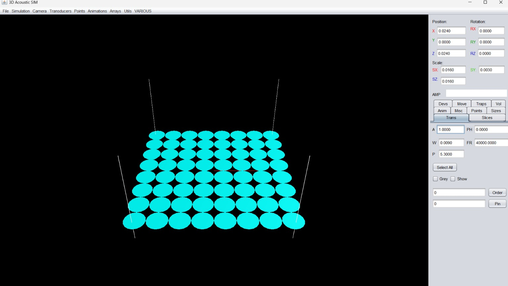

# Single-Sided Acoustic Levitation and Particle Manipulation

## Introduction

Acoustic levitation is a contactless technique used to suspend and manipulate
small objects or particles using ultrasonic acoustic waves.

This project focuses on the development of a single-sided acoustic levitation
system using an 8 × 8 array of 64 ultrasonic transducers. The selected
HY40A16T12-1 transducers operate at 40 kHz and are used to generate the
acoustic pressure field required for particle levitation and manipulation.

The system combines ultrasonic transducers, Arduino Mega control, TC4427
driver circuits, a custom PCB, and computer-based Java/NetBeans software.

## Project Hardware

- 64 × HY40A16T12-1 ultrasonic transducers
- Operating frequency: 40 kHz
- Arrangement: 8 × 8
- Arduino Mega
- TC4427 driver ICs
- Custom PCB
- Capacitors and connectors

## Software

- Java
- NetBeans
- PC-based acoustic field control/simulation

## Working Principle

The Arduino Mega receives control information from the computer and provides
the required timing and control signals to the driver circuitry. The TC4427
driver circuits drive the ultrasonic transducers. The 64 transducers generate
ultrasonic waves that combine to form the acoustic pressure field used for
contactless particle levitation and manipulation.

## Project Images

### 3D Printing Board

### NetBeans Setup

